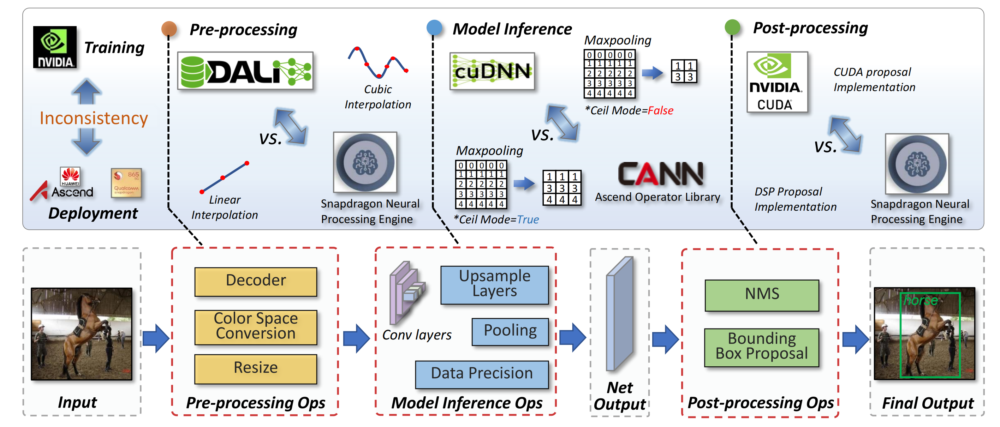

# SysNoise: Exploring Training-Deployment System Inconsistency

## Abstract
We introduce SysNoise, a frequently occurred but often overlooked noise in the deep learning training-deployment cycle. In particular, SysNoise happens when the source training system switches to a disparate target system in deployments, where various tiny system mismatch adds up to a non-negligible difference. We identify and classify SysNoise into three categories based on the inference stage, namely pre-processing noise, model inference noise, and post-processing noise. Then, we build a holistic benchmark to quantitatively measure the impact of SysNoise, comprehending image classification and object detection tasks. Specifically, we find a well-trained ResNet-50 can degenerate to a ResNet-34 under certain cases of SysNoise and much worse. Additionally, SysNoise seems to be highly diverse and common mitigations like data augmentation and adversarial training show limited effects on it, revealing its distinction from the existing adversarial noises and natural noises. Together, our findings open a new research topic and we hope this work will raise research attention to deep learning deployment systems accounting for model performance.

## Results 
###ImageNet Classification
|Architecture| Trained ACC | Decode $\Delta$ ACC  | Resize $\Delta$ ACC | Color Mode $\Delta$ ACC | FP16 $\Delta$ ACC | Int8 $\Delta$ ACC | Ceil Mode $\Delta$ ACC |
|------------|------------|------------|------------|------------|------------|------------|------------|
|ResNet18x0.125 | 33.62 | 2.10+-5.86E-01 | 2.26+-1.21E-02 | 0.15  | -0.01 | 1.16  | 2.97 |
|ResNet18x0.25 | 48.96  | 1.98+-1.01E+00  | 2.11+-1.56E-01 | 0.14  | -0.01 | 0.82  | 2.34 |
|ResNet18x0.5 | 61.64 | 1.67+-9.68E-01 | 1.76+-5.03E-03 | 0.19  | -0.01 | 0.15  | 2.72 |
|ResNet-18 | 69.96 | 1.02+-1.30E-02 | 1.01+-6.60E-01 | 0.13  | 0.00 | 0.20  | 2.40 |
|ResNet-34 | 73.59 | 0.99+-8.00E-03 | 0.77+-5.57E-01 | 0.14   | 0.00 | 0.04  | 0.85 |
|ResNet-50 | 76.39   | 0.98+-3.46E-03 | 0.75+-5.67E-01 | 0.09  | 0.00 | 0.06 | 1.24 |
|ResNet-101 | 78.10  | 0.68+-8.72E-03 | 0.62+-5.02E-01 | 0.24   | 0.01 | 0.69  | 0.75|
|MobileNetV2-0.5 | 64.94 | 2.34+-2.50E-02 | 2.04+-9.16E-01 | 0.18 |  0.01 | 0.57 | - |
|MobileNetV2-0.75 | 70.26 | 1.67+-6.43E-03 | 1.47+-8.00E-01 | 0.16   | 0.01 | 0.72 | - |
|MobileNetV2-1 | 73.12 | 1.70+-6.43E-03 | 1.48+-8.76E-01 | 0.07 | 0.02  | 0.77  | -  |
|MobileNetV2-1.4 | 75.84 | 1.85+-2.73E-02 |  1.65+-8.98E-01 | 0.10  | 0.01  | 0.53  | - |
|RegNetX-400M | 70.97  | 1.63+-1.40E-02 |  1.42+-7.79E-01 | 0.07 | 0.01 | 0.09  | -  |
|RegNetX-800M | 74.04  | 1.12+-1.44E-02 |	0.97+-6.24E-01 | 0.19  | 0.02 | 0.24 | -  |
|RegNetX-1.6G | 76.29  | 0.84+-1.01E-02 | 0.79+-6.98E-01 | 0.20  | 0.01 | 0.19  | - |
|RegNetX-3.2G | 77.89   | 0.61+-1.10E-02 | 0.53+-5.34E-01 | 0.20  | 0.00 | 0.24 | - | 

### Object Detection
| Method | Architecture | Trained mAP | Decode $\Delta$ mAP| Resize $\Delta$ mAP| Color Mode $\Delta$ mAP| Upsample $\Delta$ mAP| Int8 $\Delta$ mAP| Ceil Mode $\Delta$ mAP| Post Processing $\Delta$ mAP| 
|--------|--------|--------|--------|--------|--------|--------|--------|--------|--------|
|Faster RCNN FPN| ResNet-34 | 36.76 | 0.02+-2.08E-02 | 0.93+-1.28E+00 | 0.25  | 1.28 | 0.06  | 0.04 |  2.29  |
|Faster RCNN FPN | ResNet-50 | 37.36  | 0.02+-1.00E-02 | 1.12+-1.57E+00 | 0.10 | 1.66 | 0.10 | 0.03 | 2.39   |
|Faster RCNN FPN | MobileNetV2 | 30.32  | 0.01+-1.00E-02 | 0.38+-5.24E-01 | 0.24  | 0.96  | 0.07 | - | 2.23 |
|RetinaNet | ResNet-34 |  35.71  | 0.01+-1.15E-02 | 0.77+-1.09E+00 | 0.29  | 0.35 | 0.10 | 0.01 | 3.44 | 
|RetinaNet | ResNet-50|  36.59 | 0.01+-1.15E-02 | 0.99+-1.36E+00 | 0.36 | 0.69 | 0.03 | 0.01 | 3.00  |

	
## Datasets
For experiments of pre-processing, we provide the dataset for you to evaluate.

### Different ImageNet Dataset for Pre-processing
|Noise Type| Download Link |
|------|-----|
|Different Decoder + Resize Method|[Download](https://drive.google.com/file/d/13733k-iXqGMw_B2LPlKspnr5fQrMmZBI/view?usp=sharing)| 
|YUV Color Mode| [Download](https://drive.google.com/file/d/1GnU4wCa5Nsd4jDDHvavJZvdnFjhcyApr/view?usp=sharing)

### Different COCO Dataset for Pre-processing
|Noise Type| Download Link |
|------|-----|
|Pillow Decoder + Pillow.Bilinear Resize Method|[Download](https://drive.google.com/file/d/1FSD5aoQNwvsUaY6bdCIguwTQd2gOgqcs/view?usp=sharing)
|Pillow Decoder + Pillow.Nearest Resize Method|[Download](https://drive.google.com/file/d/1j2kdJTYcjzdqQBZ6ZQkJZ8H5lQPzp0Wk/view?usp=sharing)

## Note
**For Decoder and Resize noise, we strongly recommend that you use the online generation method we provide in the sample code instead of downloading their data sets. While the noise of color mode is generated on Altas, so download this dataset is necessaty.**
